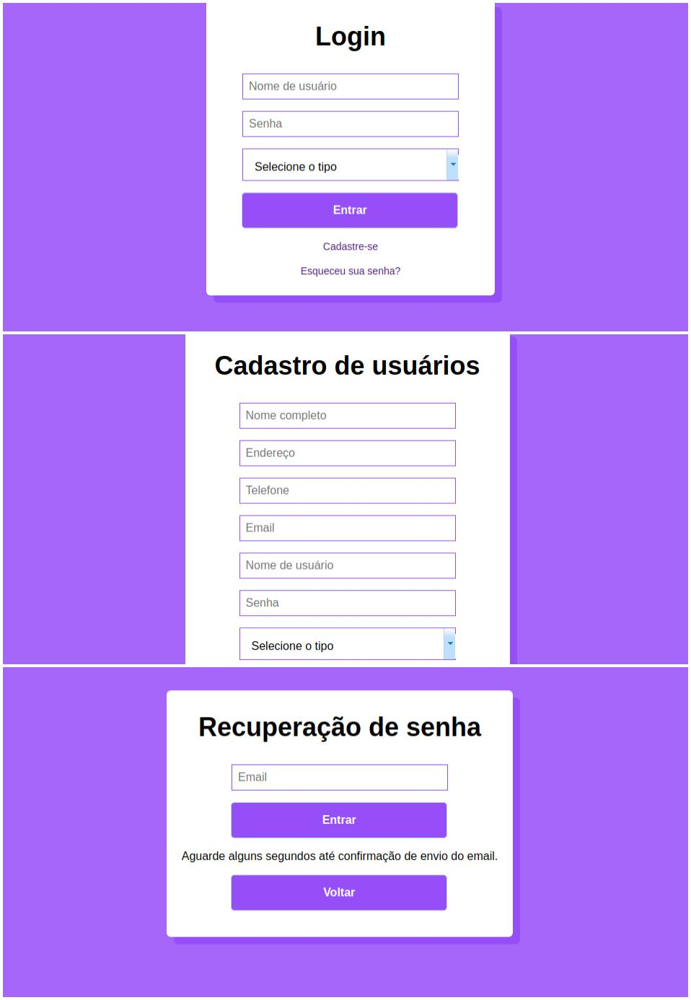

## Library-app :books:
A simple project MVC for a library how as learning

### Project

### Objetive
Learn about development JavaWeb, structure projects and systems hosting.

### Technologies
<ul>
  <li><i>Java Server Faces</i></li>
  <li><a href="https://hibernate.org/"><i>Hibernate</i></a></li>
  <li><a href="https://www.primefaces.org/showcase/"><i>Primefaces</i></a></li>
</ul>

### Features
<ul>
  <li><i>Registration and listing of users, products and suppliers</i></li>
  <li><i>Login filter for users</i></li>
  <li><i>Types of users and access to the system</i></li>
</ul>
